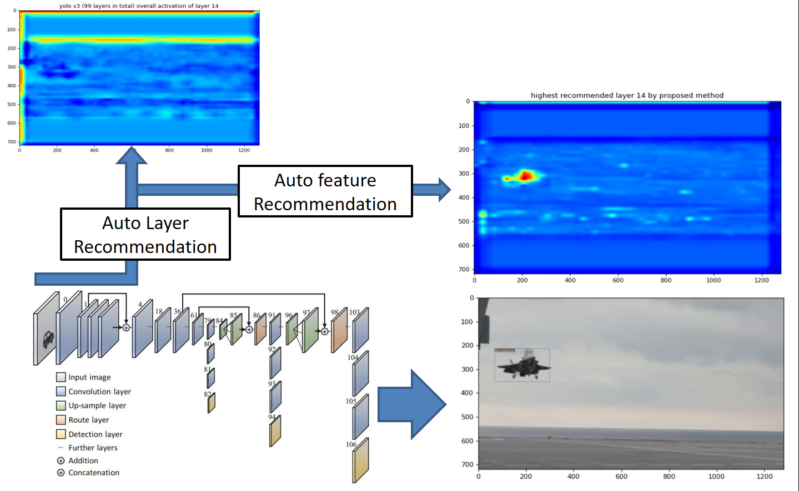
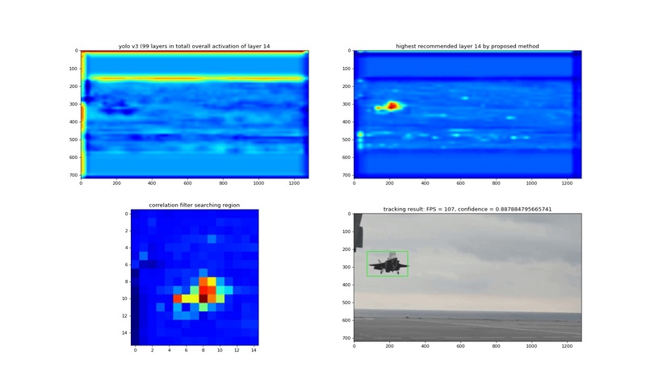
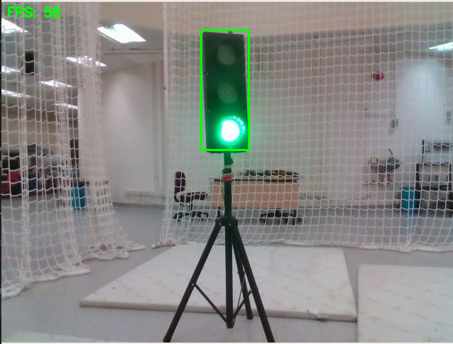

This is the Matlab demo code for the paper "Online Recommendation-based Convolutional Features for Scale-Aware Visual Tracking"

For Matlab version

Folder list:

/data: contain one benchmark dataset (Human5). (For more datasets, please download from http://cvlab.hanyang.ac.kr/tracker_benchmark/datasets.html)

/external: matconvnet (please setup the compiler for mex files)

/functions: matlab functions for visual tracking

/model: please download the VGG-19 net here
(Download the VGG-Net-19 using the link https://uofi.box.com/shared/static/kxzjhbagd6ih1rf7mjyoxn2hy70hltpl.mat
If you are in China, please use this link: http://pan.baidu.com/s/1kU1Me5T )

Run the main entry file demo.m to see the tracking results

For Pytorch version

Make sure you can successfully run yolo v3

Download yolo weights into ./weight

video_demo.py: plot cnn features output for algorithm demonstration

Results from video_demo.py

UAV_tracking_demo.py: you are free to modify yaml file for other test

Contact:
Ran Duan: 	rduan036@gmail.com